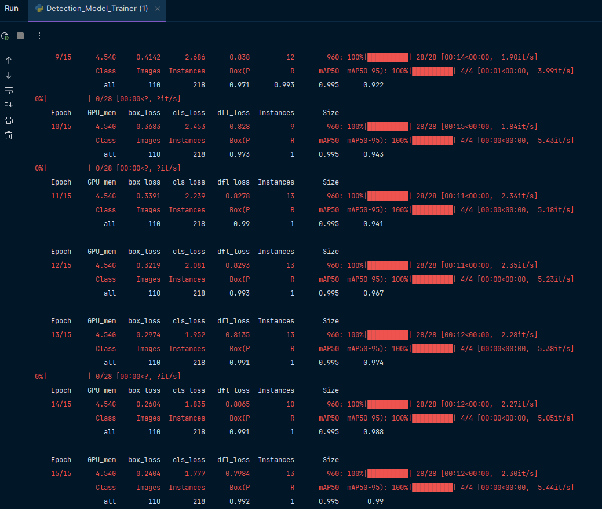
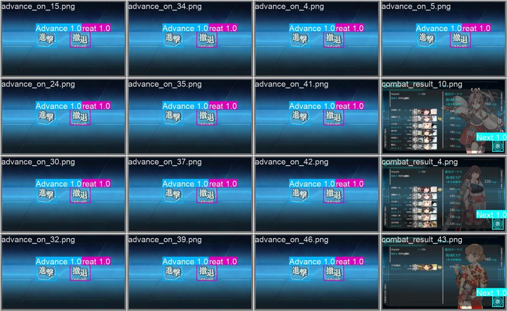
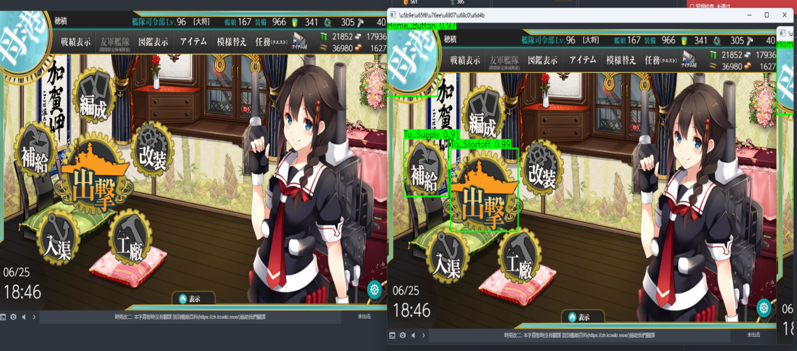

# KonColle
# mod为本人自用，不对使用者账号损失负责
# Designed for personal use.Not responsible for losses caused by this script.
个人为舰队收藏设计的自动脚本，用来减少角色升级中的操作量  
开发中······  
Auto script in development for Kantai Collection, in order to reduce the time spent in leveling up character etc.  
Still unusable and in development.  
## 效果演示（Demo）

YOLOv8n模型训练过程中控制台输出的日志片段（Example of real-time detection results using the YOLOv8n model on a game interface）:  
  
YOLOv8n模型训练完成后验证集上检测效果（Detection performance on the validation set after training the YOLOv8n model）:  
  
YOLOv8n模型在游戏界面实时检测的结果示例（Example of real-time detection results with the YOLOv8n model on a game interface）:  
  
计划先实现5-2的练级功能（带喷二的空丧练级）  
Plan to realize leveling in 5-2 first  
